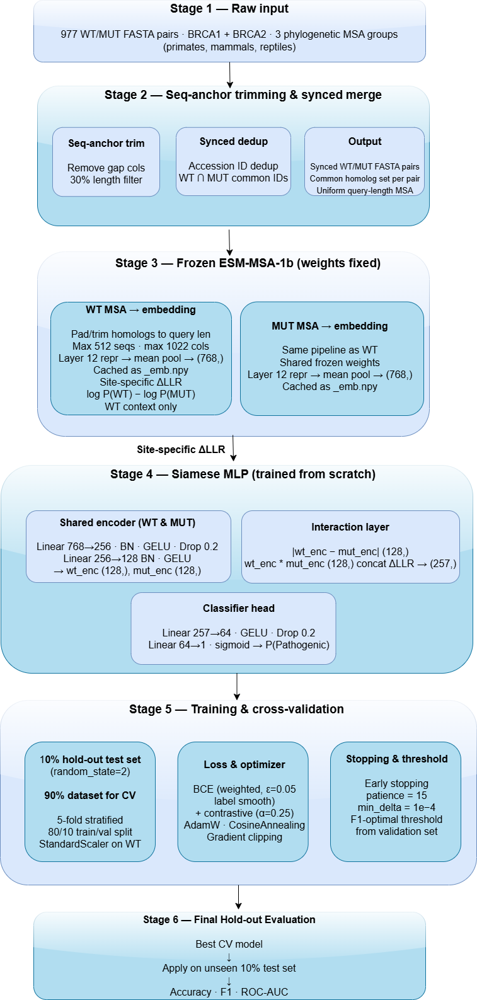

# BRCA Variant Classification using Siamese MLP & ESM-MSA-1b 🧬

[](https://www.python.org/downloads/release/python-360/)
[](https://pytorch.org/)
[](https://colab.research.google.com/)

An end-to-end Machine Learning pipeline designed to classify **BRCA1 and BRCA2** missense variants into **Pathogenic** or **Benign** categories. The project leverages the **ESM-MSA-1b** protein language model to extract high-dimensional structural representations and utilizes a **Siamese Neural Network (MLP)** for the final classification.

---

## 🏗️ Pipeline Architecture

The complete workflow is visualized below:



The methodology is broken down into 5 main stages:

1. **Stage 1 — Raw Input:** 977 WT/MUT aligned FASTA pairs for BRCA1 and BRCA2, gathered from 3 phylogenetic MSA groups (primates, mammals, reptiles).
2. **Stage 2 — Seq-anchor Trimming & Synced Merge:** Uses the query sequence as an anchor, removes gap columns, filters homologs (<30% length), and performs a **Synced Deduplication** (WT $\cap$ MUT common Accession IDs). This outputs uniform query-length MSAs with a perfectly matching homolog set per pair.
3. **Stage 3 — Feature Extraction (Frozen ESM-MSA-1b):** Pads or trims homologs to query length (max 512 seqs, 1022 cols). Extracts the mean per-residue embedding from layer 12 `(768,)`. It also computes the **Site-Specific ΔLLR** using only the WT context: `log P(WT) - log P(MUT)`.
4. **Stage 4 — Siamese MLP Architecture:** A custom neural network trained from scratch. Embeddings pass through a shared encoder (768 $\rightarrow$ 256 $\rightarrow$ 128). The interaction layer concatenates the absolute difference `|WT - MUT|`, the product `WT * MUT`, and the `Site_ΔLLR` scalar into a `(257,)` feature vector before the final classification head (64 $\rightarrow$ 1).
5. **Stage 5 — Training & Cross-Validation:** The data is split into a **10% hold-out test set** (random state = 2) and a **90% CV set**. The 90% is evaluated via 5-fold stratified CV. Training utilizes Weighted BCE (label smoothing $\epsilon=0.05$), Contrastive Loss ($\alpha=0.25$), AdamW with Cosine Annealing, and Gradient Clipping. The classification threshold is F1-optimized on the validation set per fold.
6. **Stage 6 — Final Hold-out Evaluation:** The best global model from the cross-validation folds is applied to the strictly unseen 10% test set to report the final, unbiased performance metrics (Accuracy, F1, ROC-AUC).

---

## ✨ Key Features

* **Strict Reproducibility:** Fixed random seeds across NumPy, standard libraries, and PyTorch for deterministic results.
* **No Data Leakage:** Deep structural separation between training folds and the final 10% hold-out test set. Scalers (`StandardScaler`) are fitted strictly on training sets.
* **Contrastive Learning:** Incorporates a custom contrastive loss function with a margin penalty to encourage distinct embedding spaces for Pathogenic vs. Benign variants.
* **Dynamic Downloads:** Seamless integration with Google Drive via `gdown` to handle large MSA datasets dynamically without cluttering the repository.

---

## 📊 Results

The model's performance was evaluated on a strictly unseen **10% Hold-out Test Set** to ensure fair generalization. The final metrics achieved are:

* **Accuracy:** 83.67%
* **F1-Score:** 0.7143
* **AUC-ROC:** 0.9194

*Various visualizations including PCA, UMAP, ROC Curves, and Precision-Recall Curves are generated at the end of the notebook to interpret the embedding distances.*

---

## 🚀 How to Run

The codebase is optimized for execution on **Google Colab** utilizing a T4 GPU instance.

1. **Clone the repository:**
```bash
 git clone https://github.com/AsiminaXi/BRCA_SiameseMLP.git
cd BRCA_SiameseMLP
